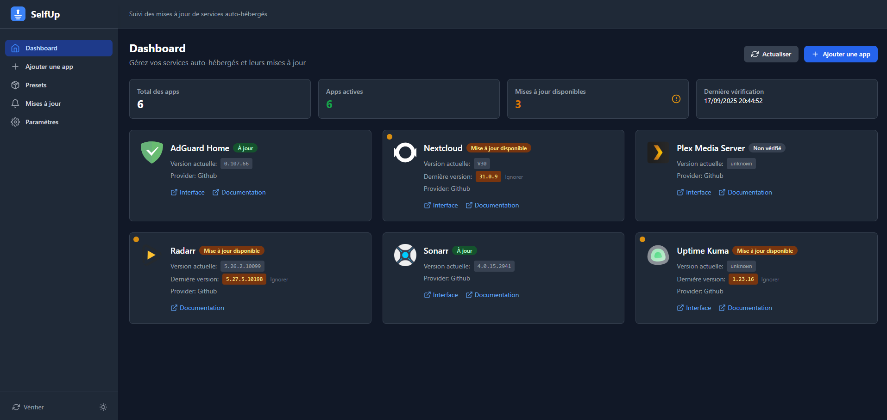

<<<<<<< HEAD
# SelfUp 🚀

**SelfUp** est une application web complète pour suivre les mises à jour de vos services auto-hébergés, conçue par un passionné pour les passionnés. Inspirée de projets comme Homarr mais spécialement axée sur les notifications de mises à jour, elle centralise la surveillance de vos applications et vous alerte via Gotify.

> **Un projet né de la passion, pas de l'expertise**
> Je ne suis pas développeur professionnel, mais un utilisateur auto-hébergé qui avait besoin d'une solution simple pour suivre ses mises à jour. Ce projet a été réalisé grâce à :
> - **L'intelligence artificielle locale** : Utilisation intensive de **Void** (interface pour Ollama) avec le modèle **Qwen3** pour comprendre les concepts, déboguer et générer du code
> - **L'apprentissage par la pratique** : Découverte de Node.js, React et des APIs en autodidacte
> - **La communauté open-source** : Inspiration et réutilisation de bonnes pratiques issues de projets existants




## 🔗 Repository GitHub

Ce projet est hébergé sur GitHub : [https://github.com/RouXx67/SelfUp](https://github.com/RouXx67/SelfUp)

## ✨ Fonctionnalités

- 📊 **Dashboard intuitif** - Vue d'ensemble de toutes vos applications
- 🔄 **Vérification automatique** - Checks périodiques des mises à jour (configurable)
- 📱 **Notifications Gotify** - Alertes push pour les nouvelles versions
- 🎯 **Providers multiples** - Support GitHub, Docker Hub, APIs génériques
- 🌙 **Mode sombre** - Interface adaptée jour/nuit
- ⚡ **Installation simple** - Script automatisé pour Debian/Ubuntu
- 🐳 **Installation LXC** - Script d'installation automatique pour conteneurs LXC/Proxmox
- 🔧 **Configuration flexible** - Variables d'environnement et interface web
- 📝 **Historique complet** - Suivi de toutes les mises à jour détectées

## 🏗️ Architecture

```
SelfUp/
├── backend/           # API Node.js + Express
│   ├── database/      # Gestion SQLite
│   ├── providers/     # Providers pour différents services
│   ├── routes/        # Routes API REST
│   └── services/      # Services (UpdateChecker, Gotify)
├── frontend/          # Interface React + Vite
│   ├── src/
│   │   ├── components/
│   │   ├── pages/
│   │   └── services/
│   └── dist/          # Build de production
└── scripts/           # Scripts d'installation et utilitaires
```

### Installation LXC/Proxmox 🚀

**Installation LXC en une ligne avec curl :**

```bash
bash -c "$(curl -fsSL https://raw.githubusercontent.com/RouXx67/SelfUp/main/scripts/install_lxc.sh)"
```

**Ou installation classique :**

Pour une installation automatique dans un conteneur LXC :

```bash
# Cloner le repository
git clone https://github.com/RouXx67/SelfUp.git
cd SelfUp

# Rendre le script exécutable
chmod +x scripts/install_lxc.sh

# Lancer l'installation LXC (nécessite root sur l'hôte Proxmox)
sudo ./scripts/install_lxc.sh
```

Le script d'installation LXC propose un **formulaire interactif** pour configurer :
- 🆔 **ID et nom** du conteneur
- 💾 **Ressources** (CPU, RAM, disque)
- 🌐 **Configuration réseau** (DHCP ou IP statique, VLAN)
- 🔧 **Installation automatique** de SelfUp dans le conteneur
- ✅ Installer Node.js 18
- ✅ Créer l'utilisateur système `selfup`
- ✅ Installer les dépendances
- ✅ Construire le frontend
- ✅ Configurer le service systemd
- ✅ Démarrer l'application

📖 **Documentation complète** : [README_LXC.md](README_LXC.md)

## 🚀 Lancer SelfUp avec `docker run`

Pour tester ou déployer rapidement SelfUp en mode développement (backend + frontend hot reload) avec le Dockerfile fourni, utilisez la commande suivante :

```bash
docker run --name selfup-dev \
  -p 3001:3001 \
  -p 5173:5173 \
  -e NODE_ENV=production \
  -e DB_PATH=/app/data/selfup.db \
  -e GOTIFY_URL=http://gotify:80 \        # (optionnel, si vous utilisez Gotify)
  -e GOTIFY_TOKEN=your_token \            # (optionnel, si vous utilisez Gotify)
  -v selfup-data:/app/data \
  rouxx67/selfup:latest
```

### Installation manuelle

<details>
<summary>Cliquez pour voir les étapes manuelles</summary>

```bash
# 1. Installer Node.js 18+
curl -fsSL https://deb.nodesource.com/setup_18.x | sudo -E bash -
sudo apt-get install -y nodejs
```bash
# 2. Cloner et configurer
git clone https://github.com/RouXx67/SelfUp.git
cd SelfUp

# 3. Installer les dépendances backend
npm install

# 4. Installer et construire le frontend
cd frontend
npm install
npm run build
cd ..

# 5. Configurer l'environnement
cp .env.example .env
nano .env

# 6. Démarrer l'application
npm start
```
</details>

## ⚙️ Configuration

### Variables d'environnement

Éditez le fichier `/opt/selfup/.env` :

```bash
# Configuration de base
PORT=3001
NODE_ENV=production

# Base de données
DB_PATH=/opt/selfup/data/selfup.db

# Configuration Gotify (optionnel)
GOTIFY_URL=http://votre-gotify:8080
GOTIFY_TOKEN=votre_token_gotify

# Vérification des mises à jour
CHECK_INTERVAL_HOURS=6
DEFAULT_TIMEOUT=10000
```

## 📱 Utilisation

### Accès à l'interface

Ouvrez votre navigateur et allez sur : `http://votre-serveur:3001`

### Ajouter une application

1. Cliquez sur **"Ajouter une app"**
2. Choisissez un **preset** ou configurez manuellement :
   - **Nom** : Nom de votre application
   - **Provider** : GitHub, Docker Hub, ou Générique
   - **URL de vérification** : URL pour checker les versions
   - **URLs optionnelles** : Interface web, documentation

### Exemples de configuration

#### Radarr (GitHub)
```
Nom: Radarr
Provider: GitHub
URL de vérification: https://api.github.com/repos/Radarr/Radarr/releases/latest
URL de mise à jour: https://wiki.servarr.com/radarr/installation
URL interface: http://localhost:7878
```

#### LinuxServer Radarr (Docker Hub)
```
Nom: Radarr Docker
Provider: Docker Hub  
URL de vérification: linuxserver/radarr
URL de mise à jour: https://hub.docker.com/r/linuxserver/radarr
```

#### API personnalisée (Générique)
```
Nom: Mon App
Provider: Générique
URL de vérification: https://api.monapp.com/version
URL de mise à jour: https://monapp.com/releases
```

## 🔧 Gestion du service

```bash
# Statut du service
sudo systemctl status selfup

# Démarrer/Arrêter/Redémarrer
sudo systemctl start selfup
sudo systemctl stop selfup
sudo systemctl restart selfup

# Voir les logs
sudo journalctl -u selfup -f

# Mise à jour de SelfUp
sudo /opt/selfup/scripts/update.sh
```

## 🛠️ Développement

### Prérequis
- Node.js 18+
- npm ou yarn

### Démarrage en mode développement

```bash
# Cloner le projet
git clone https://github.com/RouXx67/SelfUp.git
cd SelfUp

# Installer les dépendances
npm run install:all

# Configurer l'environnement
cp .env.example .env

# Démarrer en mode dev (backend + frontend)
npm run dev
```

Le backend sera accessible sur `http://localhost:3001` et le frontend sur `http://localhost:5173`.

### Structure des providers

Pour ajouter un nouveau provider, créez un fichier dans `backend/providers/` :

```javascript
class MonProvider {
  constructor() {
    this.name = 'monprovider';
  }

  async getLatestVersion(checkUrl) {
    // Logique pour récupérer la dernière version
    return {
      version: '1.2.3',
      changelogUrl: 'https://...',
      releaseDate: '2024-01-01'
    };
  }

  validateUrl(url) {
    // Validation de l'URL
    return true;
  }
}

module.exports = MonProvider;
```

## 📊 API REST

### Endpoints principaux

```
GET    /api/apps              # Liste des applications
POST   /api/apps              # Créer une application
PUT    /api/apps/:id          # Modifier une application
DELETE /api/apps/:id          # Supprimer une application

GET    /api/updates           # Historique des mises à jour
POST   /api/updates/check     # Vérification manuelle
POST   /api/updates/check-all # Vérifier toutes les apps

GET    /api/health            # État de l'API
```

### Exemple d'utilisation

```bash
# Lister les applications
curl http://localhost:3001/api/apps

# Forcer une vérification
curl -X POST http://localhost:3001/api/updates/check-all
```

## 🐳 Docker (Optionnel)

<details>
<summary>Configuration Docker</summary>

```dockerfile
# Dockerfile
FROM node:18-alpine

WORKDIR /app
COPY package*.json ./
RUN npm install --production

COPY . .
RUN cd frontend && npm install && npm run build

EXPOSE 3001
CMD ["node", "backend/server.js"]
```

```yaml
# docker-compose.yml
version: '3.8'
services:
  selfup:
    build: .
    ports:
      - "3001:3001"
    environment:
      - NODE_ENV=production
      - DB_PATH=/app/data/selfup.db
      - GOTIFY_URL=http://gotify:80
      - GOTIFY_TOKEN=your_token
    volumes:
      - selfup-data:/app/data
    restart: unless-stopped

volumes:
  selfup-data:
```
</details>

## 🔍 Dépannage

### Problèmes courants

**Service ne démarre pas**
```bash
# Vérifier les logs
sudo journalctl -u selfup -n 50

# Vérifier la configuration
sudo -u selfup node /opt/selfup/app/backend/server.js
```

**Notifications Gotify ne fonctionnent pas**
```bash
# Tester la connexion
curl -X POST "http://votre-gotify:8080/message" \
  -H "X-Gotify-Key: votre_token" \
  -H "Content-Type: application/json" \
  -d '{"title":"Test","message":"Test SelfUp"}'
```

**Base de données corrompue**
```bash
# Sauvegarder et recréer
sudo systemctl stop selfup
sudo -u selfup cp /opt/selfup/data/selfup.db /opt/selfup/data/selfup.db.backup
sudo -u selfup rm /opt/selfup/data/selfup.db
sudo systemctl start selfup
```

## 🤝 Contribution

Les contributions sont les bienvenues ! 

1. Fork le projet
2. Créez une branche feature (`git checkout -b feature/AmazingFeature`)
3. Committez vos changements (`git commit -m 'Add AmazingFeature'`)
4. Push vers la branche (`git push origin feature/AmazingFeature`)
5. Ouvrez une Pull Request

## 📄 Licence

Ce projet est sous licence MIT. Voir le fichier [LICENSE](LICENSE) pour plus de détails.

## 🙏 Remerciements

- [Homarr](https://github.com/ajnart/homarr) pour l'inspiration
- [Gotify](https://gotify.net/) pour les notifications
- La communauté self-hosted pour les retours

---

**SelfUp** - Gardez vos services à jour, simplement. 🚀
=======
# SelfUp 🚀

**SelfUp** est une application web complète pour suivre les mises à jour de vos services auto-hébergés, conçue par un passionné pour les passionnés. Inspirée de projets comme Homarr mais spécialement axée sur les notifications de mises à jour, elle centralise la surveillance de vos applications et vous alerte via Gotify.

> **Un projet né de la passion, pas de l'expertise**
> Je ne suis pas développeur professionnel, mais un utilisateur auto-hébergé qui avait besoin d'une solution simple pour suivre ses mises à jour. Ce projet a été réalisé grâce à :
> - **L'intelligence artificielle locale** : Utilisation intensive de **Void** (interface pour Ollama) avec le modèle **Qwen3** pour comprendre les concepts, déboguer et générer du code
> - **L'apprentissage par la pratique** : Découverte de Node.js, React et des APIs en autodidacte
> - **La communauté open-source** : Inspiration et réutilisation de bonnes pratiques issues de projets existants


## 🔗 Repository GitHub

Ce projet est hébergé sur GitHub : [https://github.com/RouXx67/SelfUp](https://github.com/RouXx67/SelfUp)

## ✨ Fonctionnalités

- 📊 **Dashboard intuitif** - Vue d'ensemble de toutes vos applications
- 🔄 **Vérification automatique** - Checks périodiques des mises à jour (configurable)
- 📱 **Notifications Gotify** - Alertes push pour les nouvelles versions
- 🎯 **Providers multiples** - Support GitHub, Docker Hub, APIs génériques
- 🌙 **Mode sombre** - Interface adaptée jour/nuit
- ⚡ **Installation simple** - Script automatisé pour Debian/Ubuntu
- 🐳 **Installation LXC** - Script d'installation automatique pour conteneurs LXC/Proxmox
- 🔧 **Configuration flexible** - Variables d'environnement et interface web
- 📝 **Historique complet** - Suivi de toutes les mises à jour détectées

## 🏗️ Architecture

```
SelfUp/
├── backend/           # API Node.js + Express
│   ├── database/      # Gestion SQLite
│   ├── providers/     # Providers pour différents services
│   ├── routes/        # Routes API REST
│   └── services/      # Services (UpdateChecker, Gotify)
├── frontend/          # Interface React + Vite
│   ├── src/
│   │   ├── components/
│   │   ├── pages/
│   │   └── services/
│   └── dist/          # Build de production
└── scripts/           # Scripts d'installation et utilitaires
```

### Installation LXC/Proxmox 🚀

**Installation LXC en une ligne avec curl :**

```bash
bash -c "$(curl -fsSL https://raw.githubusercontent.com/RouXx67/SelfUp/main/scripts/install_lxc.sh)"
```

**Ou installation classique :**

Pour une installation automatique dans un conteneur LXC :

```bash
# Cloner le repository
git clone https://github.com/RouXx67/SelfUp.git
cd SelfUp

# Rendre le script exécutable
chmod +x scripts/install_lxc.sh

# Lancer l'installation LXC (nécessite root sur l'hôte Proxmox)
sudo ./scripts/install_lxc.sh
```

Le script d'installation LXC propose un **formulaire interactif** pour configurer :
- 🆔 **ID et nom** du conteneur
- 💾 **Ressources** (CPU, RAM, disque)
- 🌐 **Configuration réseau** (DHCP ou IP statique, VLAN)
- 🔧 **Installation automatique** de SelfUp dans le conteneur
- ✅ Installer Node.js 18
- ✅ Créer l'utilisateur système `selfup`
- ✅ Installer les dépendances
- ✅ Construire le frontend
- ✅ Configurer le service systemd
- ✅ Démarrer l'application

📖 **Documentation complète** : [README_LXC.md](README_LXC.md)

### Installation manuelle

<details>
<summary>Cliquez pour voir les étapes manuelles</summary>

```bash
# 1. Installer Node.js 18+
curl -fsSL https://deb.nodesource.com/setup_18.x | sudo -E bash -
sudo apt-get install -y nodejs
```bash
# 2. Cloner et configurer
git clone https://github.com/RouXx67/SelfUp.git
cd SelfUp

# 3. Installer les dépendances backend
npm install

# 4. Installer et construire le frontend
cd frontend
npm install
npm run build
cd ..

# 5. Configurer l'environnement
cp .env.example .env
nano .env

# 6. Démarrer l'application
npm start
```
</details>

## ⚙️ Configuration

### Variables d'environnement

Éditez le fichier `/opt/selfup/.env` :

```bash
# Configuration de base
PORT=3001
NODE_ENV=production

# Base de données
DB_PATH=/opt/selfup/data/selfup.db

# Configuration Gotify (optionnel)
GOTIFY_URL=http://votre-gotify:8080
GOTIFY_TOKEN=votre_token_gotify

# Vérification des mises à jour
CHECK_INTERVAL_HOURS=6
DEFAULT_TIMEOUT=10000
```

## 📱 Utilisation

### Accès à l'interface

Ouvrez votre navigateur et allez sur : `http://votre-serveur:3001`

### Ajouter une application

1. Cliquez sur **"Ajouter une app"**
2. Choisissez un **preset** ou configurez manuellement :
   - **Nom** : Nom de votre application
   - **Provider** : GitHub, Docker Hub, ou Générique
   - **URL de vérification** : URL pour checker les versions
   - **URLs optionnelles** : Interface web, documentation

### Exemples de configuration

#### Radarr (GitHub)
```
Nom: Radarr
Provider: GitHub
URL de vérification: https://api.github.com/repos/Radarr/Radarr/releases/latest
URL de mise à jour: https://wiki.servarr.com/radarr/installation
URL interface: http://localhost:7878
```

#### LinuxServer Radarr (Docker Hub)
```
Nom: Radarr Docker
Provider: Docker Hub  
URL de vérification: linuxserver/radarr
URL de mise à jour: https://hub.docker.com/r/linuxserver/radarr
```

#### API personnalisée (Générique)
```
Nom: Mon App
Provider: Générique
URL de vérification: https://api.monapp.com/version
URL de mise à jour: https://monapp.com/releases
```

## 🔧 Gestion du service

```bash
# Statut du service
sudo systemctl status selfup

# Démarrer/Arrêter/Redémarrer
sudo systemctl start selfup
sudo systemctl stop selfup
sudo systemctl restart selfup

# Voir les logs
sudo journalctl -u selfup -f

# Mise à jour de SelfUp
sudo /opt/selfup/scripts/update.sh
```

## 🛠️ Développement

### Prérequis
- Node.js 18+
- npm ou yarn

### Démarrage en mode développement

```bash
# Cloner le projet
git clone https://github.com/RouXx67/SelfUp.git
cd SelfUp

# Installer les dépendances
npm run install:all

# Configurer l'environnement
cp .env.example .env

# Démarrer en mode dev (backend + frontend)
npm run dev
```

Le backend sera accessible sur `http://localhost:3001` et le frontend sur `http://localhost:5173`.

### Structure des providers

Pour ajouter un nouveau provider, créez un fichier dans `backend/providers/` :

```javascript
class MonProvider {
  constructor() {
    this.name = 'monprovider';
  }

  async getLatestVersion(checkUrl) {
    // Logique pour récupérer la dernière version
    return {
      version: '1.2.3',
      changelogUrl: 'https://...',
      releaseDate: '2024-01-01'
    };
  }

  validateUrl(url) {
    // Validation de l'URL
    return true;
  }
}

module.exports = MonProvider;
```

## 📊 API REST

### Endpoints principaux

```
GET    /api/apps              # Liste des applications
POST   /api/apps              # Créer une application
PUT    /api/apps/:id          # Modifier une application
DELETE /api/apps/:id          # Supprimer une application

GET    /api/updates           # Historique des mises à jour
POST   /api/updates/check     # Vérification manuelle
POST   /api/updates/check-all # Vérifier toutes les apps

GET    /api/health            # État de l'API
```

### Exemple d'utilisation

```bash
# Lister les applications
curl http://localhost:3001/api/apps

# Forcer une vérification
curl -X POST http://localhost:3001/api/updates/check-all
```

## 🐳 Docker (Optionnel)

<details>
<summary>Configuration Docker</summary>

```dockerfile
# Dockerfile
FROM node:18-alpine

WORKDIR /app
COPY package*.json ./
RUN npm install --production

COPY . .
RUN cd frontend && npm install && npm run build

EXPOSE 3001
CMD ["node", "backend/server.js"]
```

```yaml
# docker-compose.yml
version: '3.8'
services:
  selfup:
    build: .
    ports:
      - "3001:3001"
    environment:
      - NODE_ENV=production
      - DB_PATH=/app/data/selfup.db
      - GOTIFY_URL=http://gotify:80
      - GOTIFY_TOKEN=your_token
    volumes:
      - selfup-data:/app/data
    restart: unless-stopped

volumes:
  selfup-data:
```
</details>

## 🔍 Dépannage

### Problèmes courants

**Service ne démarre pas**
```bash
# Vérifier les logs
sudo journalctl -u selfup -n 50

# Vérifier la configuration
sudo -u selfup node /opt/selfup/app/backend/server.js
```

**Notifications Gotify ne fonctionnent pas**
```bash
# Tester la connexion
curl -X POST "http://votre-gotify:8080/message" \
  -H "X-Gotify-Key: votre_token" \
  -H "Content-Type: application/json" \
  -d '{"title":"Test","message":"Test SelfUp"}'
```

**Base de données corrompue**
```bash
# Sauvegarder et recréer
sudo systemctl stop selfup
sudo -u selfup cp /opt/selfup/data/selfup.db /opt/selfup/data/selfup.db.backup
sudo -u selfup rm /opt/selfup/data/selfup.db
sudo systemctl start selfup
```

## 🤝 Contribution

Les contributions sont les bienvenues ! 

1. Fork le projet
2. Créez une branche feature (`git checkout -b feature/AmazingFeature`)
3. Committez vos changements (`git commit -m 'Add AmazingFeature'`)
4. Push vers la branche (`git push origin feature/AmazingFeature`)
5. Ouvrez une Pull Request

## 📄 Licence

Ce projet est sous licence MIT. Voir le fichier [LICENSE](LICENSE) pour plus de détails.

## 🙏 Remerciements

- [Homarr](https://github.com/ajnart/homarr) pour l'inspiration
- [Gotify](https://gotify.net/) pour les notifications
- La communauté self-hosted pour les retours

---

**SelfUp** - Gardez vos services à jour, simplement. 🚀
>>>>>>> b08feef1ff04506242c7993eae757930ba05a009
